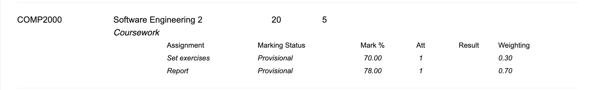

# COMP2000

In COMP2000, I am create an Android app called StaffSync which is essentially an admin-side and user-side staff management system. The app is built using Java and Android Studio, and it is designed for ease-of-use and efficiency. The app is designed to be user-friendly, with a simple and intuitive interface that allows users to easily navigate through the various features and functions. The app is also designed to be efficient, with fast loading times and smooth transitions between screens.

For more details, refer to the <a href="https://github.com/alfie-ns/StaffSync-APP/blob/main/docs/Report_COMP2000_StaffSync.md" style="color: blue;">StaffSync Project Report</a>.

# COMP2002

``...``
